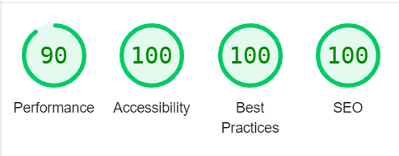

# The Blue Boar Inn
The objective of this project was to create a reservation system for the Blue Boar Inn, a fictional restaurant. At its core, the project needed a user to be able to make a reservation at the restaurant as well as being able to amend or cancel the reservation. In programming terms this means creating a database for reservations and allowing users full CRUD (Create, Read, Update, Delete) control over that data.

### Strategy
The overall approach was to build a full stack application using the Django framework linked to a PostgreSQL database. PostgresSQL is a popular and adaptable relational database management system and Django is a flexible framework which easily integrates API's, allowing for a streamlined development cycle. Both are open source and well supported allowing for easy maintenance, future development and customisation. Bootstrap 5 was to be used at the front end to speed up the design process.

The site was designed using an Agile approach. Epics and user stories were collected, added to a [kanban board](https://github.com/users/ewradcliffe/projects/5/views/1) in the project [Githib repository](https://github.com/ewradcliffe/restaurant-booking-system) and prioritised according to the MOSCOW system. MOSCOW organises stories and features into 'Must have', 'Should have', 'Could have', 'Won't have' categories. This allows Agile developers to prioritise which parts of the programme to create first. After a fixed period of time the development cycle ends and the project is reviewed. features may be recategorised and additional user stories added throughout based on testing and feedback received.

### Scope
The below epics and user stories were collected. Epics were broken down into user stories, added to the project [kanban board](https://github.com/users/ewradcliffe/projects/5/views/1). Additional user stories were added based on feedback.

#### Epics
- Creation of a full stack web application to manage restaurant reservations using Django.
- Staff should have full CRUD control over all reservations via the Admin panel.
- Customers should have full CRUD control over their reservations via the front end of the site.
- The site should display a menu.
- The site front end should support the overall marketing strategy of the business.
- Development of comprehensive documentation to support maintenance and development of the site.

#### Must have
Must have features are features without which the project will not work.
- [Staff can make reservations on behalf of customers](https://github.com/users/ewradcliffe/projects/5/views/1?pane=issue&itemId=73488282)
- [Staff can edit reservations on behalf of customers](https://github.com/users/ewradcliffe/projects/5/views/1?pane=issue&itemId=74915945)
- [Staff can delete reservations on behalf of customers](https://github.com/users/ewradcliffe/projects/5/views/1?pane=issue&itemId=74916026)
- [Staff should have accounts with enhanced access so they have CRUD access to reservation, user and menu databases. These accounts should be password protected for reasons of data security and to prevent malicious use.](https://github.com/users/ewradcliffe/projects/5/views/1?pane=issue&itemId=73488956)
- [Customers should be able to create an account so their data is protected with a password](https://github.com/users/ewradcliffe/projects/5/views/1?pane=issue&itemId=73488956)
- [Customers can make reservations online.](https://github.com/users/ewradcliffe/projects/5/views/1?pane=issue&itemId=73488791)
- [Customers can edit reservations online.](https://github.com/users/ewradcliffe/projects/5/views/1?pane=issue&itemId=74915566)
- [Customers can delete reservations online.](https://github.com/users/ewradcliffe/projects/5/views/1?pane=issue&itemId=74915437)
- [Automated tests should be created to ensure users have full CRUD control over reservations once logged in.](https://github.com/users/ewradcliffe/projects/5/views/1?pane=issue&itemId=74916186)
- [Automated tests should be created to ensure the reservation database works correctly.](https://github.com/users/ewradcliffe/projects/5/views/1?pane=issue&itemId=78005401)
- [Automated tests should be created to ensure the menu database works correctly.](https://github.com/users/ewradcliffe/projects/5/views/1?pane=issue&itemId=78005720)

#### Should have
Features not essential to the functioning of the project, but will add significant value to the project.
- [The site should tell users if they are logged in. The message advising them they are not should link to the login page.](https://github.com/users/ewradcliffe/projects/5/views/1?pane=issue&itemId=77004143)
- [The site should be able to display the restaurant menu.](https://github.com/users/ewradcliffe/projects/5/views/1?pane=issue&itemId=73489183)
- [The site should prevent users making reservations in the past.](https://github.com/users/ewradcliffe/projects/5/views/1?pane=issue&itemId=74917161)
- [The front end of the programme should be designed to allow for intuitive use.](https://github.com/users/ewradcliffe/projects/5/views/1?pane=issue&itemId=74917009)
- [Menu should be visible to customers without a login.](https://github.com/users/ewradcliffe/projects/5/views/1?pane=issue&itemId=73489292)
- [The website should support the marketing objectives of the business.](https://github.com/users/ewradcliffe/projects/5/views/1?pane=issue&itemId=73489644)
- [Pop up messages should stand out more from the background](https://github.com/ewradcliffe/restaurant-booking-system/issues/21)

#### Could have
Features which may be useful, but will not add as much value to the site. These were changed to won't have in the current development cycle.
- [Customers can submit special queries via the website.](https://github.com/users/ewradcliffe/projects/5/views/1?pane=issue&itemId=73489518)
- [Website displays additional information to the customer.](https://github.com/ewradcliffe/restaurant-booking-system/issues/8)

#### Won't have
Features which will not be part of the iteration of development. May be considered in future cycles. These have been added to the Kanban board.
- [Restaurant staff can add pictures to the menu.](https://github.com/ewradcliffe/restaurant-booking-system/issues/22)
- [A system for matching reservations with tables.](https://github.com/ewradcliffe/restaurant-booking-system/issues/23)
- [A system for capping reservation numbers at any given point in time.](https://github.com/ewradcliffe/restaurant-booking-system/issues/24)

In accordance with Agile development principles, development would begin with the 'must have' features. Together these would form a 'minimal viable product' (MVP). 'Should have' features would be added, prioritising (in order) making a reservation, user experience, restaurant marketing and displaying a menu. In that way a product could be developed as soon as possible and continually developed and improved while maintaining utility.

### Structure
Once the scope of the project for the initial cycle of Agile development had been decided it was clear how the project could be structured. An overall project (titled 'restaurant') was created and to it linked an app (titled 'reservations'). Data could be stored in a PostgreSQL database. If time was permitted in the development cycle a second app (titled 'menu') could be added. Models, Views and Templates for both apps were planned in accordance with Django's Model View Template (MVT) paradigm.

##### Authentication
The Django allauth package was installed to manage the user authentication process. A superuser created with access to the admin page. The documentation can be found [here](https://docs.allauth.org/en/latest/).

Summernote, meta and string methods were used to add meta data to database entries to add functionality and improve user experience in the admin page.

###### base.HTML
Not linked to a view, the base.html template consists of the header and footer with the content of other templates rendered in the main section depending on user selection.

#### Reservations app
##### Model
Django has a built in User Model so it was only necessary to plan a model for the table handling reservations made by the user ('Reservations'). The below Entity Relationship Diagram (ERD) shows the table fields.

The model allows for a number of fields essential or useful for managing a reservation. Note that Django ads an ID field to each model by default, adding a unique identification to each database entry.

**reservation_name** allows the creator of the entry a reference separate from their username. It allows staff to add reservations on behalf of others and for customers to give guests a reference separate to the username they created the account with.

**reservation_date, reservation_time** and **number_of_guests** are all essential information for a restaurant.The reservation_time and number_of_guests fields are set to choices (providing users with a fixed number of input choices) rather than TimeField or NumField inputs. This was the most straightforward way of presenting the user with limited inputs preventing them booking outside opening hours or booking for too many guests.

**email_field** was added as the project scope required staff to be able to make reservations on behalf of customers unable (or unwilling) to book online and it was useful for staff to take some customer contact details. It was set to null and not linked to the User model as it isn't a mandatory field when users create an account.

**reservation_booked_by** field allows tracking of the person entering the reservation into the database, either via the site front as a customer who has created an account, or by staff through the admin panel. This supports display of that customer's reservations to a logged in customer, while preventing them viewing other reservations. This has been set to ondelete=null as where reservations made by staff need to remain in the database even after deletion of the profile. Staff turnover can be high in the hospitality sector!

**reservation_created_on** and **reservation_updated_on** are set to automatically add the date and time of any database entries and modifications to the database entry. This could prove useful in managing large sets of data.

The Reservation Model is converted to a form in forms.py. The fields reservation_name, reservation_date, reservation_time and number_of_guests are extracted to be displayed to the user as input fields. Django's DateInput widget is added to the reservation_date field to display a datepicker, which is set to only allow users to select same day or future reservations.

##### View
The below views were created to filter data.

###### index
As the only role of the index was to render the front page content no complex programming was required.

##### ReservationList
This renders a list of reservations already created. Note that reservations not made by the user are filtered out by the template not the view. This has no impact on the performance of a small app, but could impact performance of a larger app. It is a point for consideration for future phases of  development.

##### check_time.
This function compares the time and date of a reservation against the datetime module to check if a reservation is in the past. Note that the project has been left with the default time zone settings of UTC unchanged and the function derives its time from the server running the application using the datetime.now() method.

##### add_reservation
This view renders the reservation form derived from the model to the screen. If the data entered is valid (as per the parameters of the model) it checks if the entry is not in the past using the check_time function. If this is valid it saves the data in the database and provides a validation message to the user. If not it advises the user of the error.

##### delete_reservation
This view is triggered when a user clicks on the 'delete' button of a reservation. It uses the ID of the entry the user selects to GET the corresponding data from the database and display it to the user. The user is asked to confirm they want to delete the reservation. If not they are returned to the reservations page, if they select yes the confirm_delete_reservation page view is triggered.
       
##### confirm_delete_reservation
If the user confirms they want to delete the reservation this function is triggered. It deletes the entry from the database, returns the user to the reservation page and displays a message confirming the reservation has been deleted.

##### edit_reservation
This view is triggered if the user selects the edit reservation button on an existing reservation. It uses the ID of the entry the user selects to GET the corresponding data from the database, and renders it to the make_reservation template as context.This allows users to update database entries in a way familiar from when they made the entry. It performs the same validation checks as the add_reservation view. Users are presented with appropriate feedback if they enter invalid data, and a success message once the update has been a success.

##### Templates
###### index.html
Displays as the front page to a user who lands on the page for the first time. The user sees some photographs and text which convey the ambience of the restaurant. There is a button linking to the page where they can make a reservation as a call to action.

###### reservation.html
If a user is logged in they are presented with a message advising them as such and linked to the page where they can sign in. Once they are logged in they can see a list of reservations they have made displayed as cards. They can edit or delete these reservations by clicking the appropriately titled buttons. They can also make new reservations by clicking the 'make reservations' button.

##### delete_reservation.html
This template renders the detail of a reservation to the page if the user selects the 'delete' button on a reservation. It asks the user if they are sure they want to delete the reservation.

###### make_reservation.html
This is used by both the add_reservation and edit_reservation views to render the reservation form using crispy forms.

#### Menu app
As displaying a menu was a 'should have' rather than 'must have' feature this was planned and added after development of the Reservations app. Note that only users with access to the Admin page have full CRUD control over the database. Other users can only read the data as it is displayed on the front end of the site.

#####  Menu model
The Entity Relationship Diagram (ERD) below was prepared prior to development.

**menu_entry_type** provides the user with a choice between Starter, Main, Dessert or Drinks for their entry, corresponding with a section on the menu page on the site. This allows for logical display of data on the front end of the site.

**menu_entry_name** Allows the user to provide a suitable name for the dish while **menu_entry_description** allows them to add a longer description. Both have character limits to support conservation of space on the front end display.

**menu_entry_price** allows users to enter a price for the entry. It is currency agnostic and use of max digits and decimal places allows for entries between 000.00 and 999.99.

**menu_entry_by** Automatically adds the user who added the entry to the database as a foreign key. As with the reservations model, on_delete is set to null so that user accounts could be deleted without deleting database entries they had made. Note however that any user with admin access has full CRUD access to this database.

##### View
The menu app only needs a single view. This extracts data from the database and adds it as context to the menu template. It also sets out the categories in a tuple so they can be added as context to the menu template

##### Template
The menu.html template displays the categories for menu items to the screen. It then uses a for loop to iterate through the database entries and display the selected fields under the appropriate category heading.

### Skeleton
The site was designed to have intuitive navigation and use, and follow the principles of mobile first design. The below wireframes were drafted as a guideline for the development of the site.

- Landing page, Reservations and Menu page (Mobile view).

- Delete reservations (mobile and large screen).

- Large screen landing and reservation page (large screen).

- Large screen menu and make/edit reservations (large screen).

The standard log in/log out, sign up etc. pages from allauth. They will be styled consistently with the rest of the site.

A consistent header and footer appears on all pages. The header consists of a navigation bar with the restaurant logo in the top left hand corner and if clicked returns the user to the home page. A three bar 'burger' button opens a drop down menu when clicked, allowing the user quick navigation to the home page, the reservation page, the menu page, the register and log in page (if not logged in) or the sign out page (if logged in). On  screens of 980px and above the burger button is replaced with individual tabs for the above pages. The navigation bar also gives the user login status. This can also be used to navigate to the log in or register pages if they are not logged in. The footer displays links to social media sites and on screens of 768px and above the footer expands to give the opening hours and address of the restaurant.

**Mobile and large screen versions of the header and footer.**

")
")

The most prominent buttons change colour when the mouse is hovered over it.

The landing page sets the brand of the restaurant, with a hero image of a log fire, pictures of food, and text describing the history of the restaurant. At the bottom there is a call to action to click the 'Make a reservation' button.

**Mobile and large screen versions of the reservation page.**

")
")

If logged in, the make a reservation page displays existing reservations as 'cards' using the bootstrap feature. The cards have buttons to edit or delete the reservations. A large button invites the user to 'Make a reservation'. If not logged in the user is advised as such with text linking them to the corresponding login and register pages.

**Mobile and large screen versions of the reservation page.**

")
")

On clicking the 'Make a reservation button' the user is directed to a form with input fields for name, date (with a datepicker), time and number of guests drop down menu, and a submit button. Past dates on the datepicker are greyed out. If the user tries to submit empty or invalid data they are advised of the error in red text. The page remains displayed so they can easily correct the error. Once the reservation has been successfully made they are returned to the reservation page where they can see their reservation and a pop up message confirms their success.

**Image of page with successful reservation and pop up message.**

**Example of an error message. The name field has been left blank.**

**Mobile and large screen versions of the add reservation page.**

")

")

Clicking on the 'edit' button on a reservation card takes the user to a the same page as they used to make a reservation, excepting the form is prepopulated with the details of the existing reservation. The details can be amended here and the submission process is identical with the above.

**Mobile and large screen versions of the edit reservation page.**

")

")

Clicking on the 'delete' button on a reservation card takes the user to a new page displaying the reservation details. The user has the option to delete the reservation or return to the reservation page. In either case they are returned to the reservation page. If they choose to delete the reservation a pop up message advises them of the success of the action.

**Mobile and large screen versions of the delete reservation page.**

")
")

Clicking on the menu tab takes the user to the restaurant menu. Items are grouped under 'Starter', 'Main', 'Dessert' or 'Drink' depending on type. Items are logically displayed in boxes, with the name in bold, a short description and price.

**Mobile and large screen versions of the menu page.**

")
")

Clicking on either the 'register' or 'log in' buttons takes the user to pages where the user can perform these corresponding actions. The user also has the option to reset password via email. If the user clicks the 'sign out' button they are taken to a page asking them to confirm the decision.

**Mobile and large screen versions of the sign up page.**

")
")

### Surface
The surface of the page was designed in line with the marketing objectives of the site. The Blue Boar Inn presents itself as a relaxing and cosy restaurant which leans heavily into its historical links. The below stylings were selected as supportive of this.

Some styling was added to the authentication pages to make them fit the themes of the project, however they are otherwise unchanged.

###### Fonts.
IM Fell English SC was selected for the majority of the text. Bokor was selected for the logo. Both are mediaeval looking fonts which link the restaurant to its mediaeval origins. Bokor distinguishes the restaurant logo from the majority of the text.

###### Colours
The below colour palette was selected to support the site branding. A warm palette supports the cosy, comfortable image. The use of natural colours supports the historical image. In practical terms different colours help the user distinguish site elements.

- black - all text.
- rgb(253, 248, 216) - main background
- rgb(173, 155, 52) - header and footer
- rgb(250, 230, 120) - reservation cards
- rgb(247, 221, 79) - Message pop up
- rgb(145, 123, 4) - where an item changes colour when hovered over and a lighter colour provides a greater contrast
-  rgb(37, 32, 1) - where an item changes colour when hovered over and a darker colour provides a greater contrast
- rgb(150, 148, 148) - borders of menu items.

###### Images
Images were selected from [Pexels](https://www.pexels.com/). Some images were resized and cropped to fit the styling of the site and reduce load time. A log fireplace was used as a hero image, helping users imagine what the inside of the restaurant may be like. Images of tasty meals were added to the index page to give users an idea of what food is served.

###### Interactivity.
The main buttons have been increased in size. They change colour when hovered over to make it clear to users they can be clicked.

designers finalise the product's features such as colour, typography, and visual elements that the user will interact with

### Testing
Both manual and automated tests were used in the testing of the programme.

#### Manual tests

| Function | Test | Pass |
| :------: | ----: |  ----: |
| General | Index page fully renders with all content visible | ✓ |
| General | All links routed to correct pages | ✓ |
| General | Menu page fully renders with all content visible | ✓ |
| General | Header collapses to dropdown on small screens | ✓ |
| General | Footer minimised on small screens | ✓ |
| General | latest version deployed to Heroku | ✓ |
| Access | Users able to login with username and email | ✓ |
| Access | User given feedback as to if they are logged in or not | ✓ |
| Access | Log in feedback links to register and log in pages | ✓ |
| Access | Users unable to access admin page without proper permissions | ✓ |
| Reservations | Reservations only visible when logged in | ✓ |
| Reservations | User can only view reservations they have made | ✓ |
| Reservations | Logged in user can make a reservation | ✓ |
| Reservations | Logged in user can edit a reservation | ✓ |
| Reservations | Logged in user can delete a reservation | ✓ |
| Reservations | Logged in staff/superuser can make a reservation | ✓ |
| Reservations | Logged in staff/superuser can edit a reservation | ✓ |
| Reservations | Logged in staff/superuser can delete a reservation | ✓ |
| Reservations | Datepicker prevents user booking date prior to current date| ✓ |
| Reservations | Reservation form cannot be submitted without all fields being completed | ✓ |
| Menu | Menu page fully renders all content to correct sections | ✓ |
| Menu | Logged in staff/superuser can add menu items | ✓ |
| Menu | Logged in staff/superuser can edit menu items | ✓ |
| Menu | Logged in staff/superuser can delete menu items | ✓ |
| Menu | Menu items can only be created, edited and deleted through admin panel | ✓ |

#### Automated tests
The below automated tests were set up and pass. Please enter python3 manage.py test in the command line to repeat them

|  Programme         | Test | Pass |
| :---------------- | :------: | ----: |
| Menu Views | Confirm menu items can be seen without logging in. | ✓ |
| Menu Views | Confirm menu item can be seen after logging in | ✓ |
| Reservation Form | Tests form is valid. | ✓ |
| Reservation Form | Tests name field. | ✓ |
| Reservation Form | Tests date field. | ✓ |
| Reservation Form | Tests time field. | ✓ |
| Reservation Form | Tests number of guests field. | ✓ |
| Reservation Views | Tests to see if the index page renders. | ✓ |
| Reservation Views | Tests to see if the reservation page renders. | ✓ |
| Reservation Views | Test to see if the add reservation page is rendered. | ✓ |
| Reservation Views | Test to see if the edit reservation page works. | ✓ |
| Reservation Views | Test to see if the delete reservation page renders. | ✓ |
| Reservation Views | Test for making a reservation | ✓ |
| Reservation Views | Test for editing a reservation | ✓ |
| Reservation Views | Test for deleting a reservation | ✓ |

All tests pass as per below:

### Validation
#### Accessibility
The I have checked the index (i.e. landing), reservations, add/edit reservations and menu pages with lighthouse and [Wave](https://wave.webaim.org/aim/) with the below results.

##### Index page

##### Reservations page

##### Add/edit reservations page

##### Menu page

#### HTML
The below pages were put through the [W3C validator](https://validator.w3.org/). As the validator doesn't understand django template syntax, the URL of each page was entered into the validator

|  Page  | Pass |
| :----- | :--: |
| base.html (logged out) | ✓   |
| index.html (logged in) | ✓   |
| reservations.html (logged out) | ✓   |
| reservations.html (logged in) | ✓   |
| make_reservations.html | ✓   |
| delete_reservations.html | ✓   |
| menu.html | ✓   |
| logout.html | ✓   |
| login.html | ✓   |
| password_reset.html | ✓   |
| signup.html | x |

Signup HTML returns four errors. Unfortunately, these are all in the rendering of the form in the html of the allauth. These are seen in the lines below. They are not from code written for this project and are inaccessible for editing. Please see below for images of the error.

#### CSS
The below pages were put through the [W3C validator](https://jigsaw.w3.org/css-validator/#validate_by_input)
|  Page  | Pass | Message |
| :----- | :--: | :--: |
| static/css/style.css | ✓   | Imported style sheets are not checked in direct input and file upload modes |

The single CSS style sheet passes without error, and with the message listed above. This simply means the check is limited only to this page.

#### PEP8
The below pages were put through the [W3C validator](https://pep8ci.herokuapp.com/#) and returned no errors
|  Page  | Pass |
| :----- | :--: |
| menu/admin.py | ✓   |
| menu/apps.py | ✓   |
| menu/models.py | ✓   |
| menu/test_views.py | ✓   |
| menu/urls.py | ✓   |
| menu/views.py | ✓   |
| reservations/admin.py | ✓   |
| reservations/apps.py | ✓   |
| reservations/models.py | ✓   |
| reservations/test_forms.py | ✓   |
| reservations/test_views.py | ✓   |
| reservations/urls.py | ✓   |
| reservations/views.py | ✓   |
| restuarant/asgi.py | ✓   |
| restuarant/urls.py | ✓   |
| restuarant/settings.py | x   |
| restuarant/wsgi.py | ✓   |

Settings.py has five E501 line too long errors. These are the secret key and the 4 allauth password validators. These can't be fixed by adding a '\' without causing an error so I have left them unaltered. This does not otherwise affect the functioning of the site.

## Deployment
The application was created on Gitpod using The Code Institute template (https://github.com/Code-Institute-Org/ci-full-template) and VS Code and deployed to Github with the following steps:

1. Login to Github, otherwise create an account.

2. Navigate to the repository ('Explore -> 'ewradcliffe/restaurant-booking-system') or follow the link (https://github.com/ewradcliffe/restaurant-booking-system).

Please note that to save any changes:

1. Save as usual

2. To commit changes, enter 'git add .' in the terminal and then enter 'git commit -m "summarise changes."

3. Once all changes are made use the command 'git push' to push changes to github.

##### To deploy locally:
1. The programme can be run locally by entering python manage.py runserver into the command line and pressing enter. Select open in browser from the pop up.

##### To fork:
1. Click fork in the top right hand corner, and create new fork.

2. Confirm the owner of the fork, the repository name and description.

3. Click "Create fork".

##### To clone:

1. To clone, you must first fork the repository as per above.

2. Click on the "Code" button and copy the URL.

3. In Git Bash, navigate to the location you would like to create the cloned directory.

4. Enter git clone, paste the URL, and press enter.

##### Prior to deployment
1. If any changes have been made to the static files, please enter the command python3 manage.py collectstatic. You will be asked if you would like to overwrite existing files. Enter 'yes' to make sure all static files are collected for deployment.

2. In setting.py set DEBUG to FALSE to allow for debugging outside of the local environment.

3. Add, commit and push your changes to github.

##### Heroku

The programme is deployed on Heroku ('https://theboarshead-a33405e8a5e0.herokuapp.com/')

- To update deployments, navigate to ('https://heroku.com') and either login, or follow the steps to create an account. Navigate to the deployment tab, scroll to the bottom and click deploy branch.

- To create a new app navigate to the dashboard, click on the 'New' button and click 'Create new app' from the dropdown. Give the app a name, select your region and click create app. Please note that app names need to be unique to the platform as a whole. Heroku will not accept spaces as characters. You will need to use hyphens.

- To link an API to Heroku, navigate to the 'Settings' tab and click 'Reveal Config Vars' You will need to add a key of DATABASE_URL and a value of either the PostgreSQL database linked in settings (if linking to this project), or your own database. You will also need to add SECRET_KEY as a key and the value of the secret key found in env.py

- Navigate to the 'Deployment' tab. You will have the option to set up automatic deployment so the app is automatically updated with any changes pushed to github.

- Then connect your GitHub repository and click 'deploy branch'

## Future development.
It is recommended that The Django ('https://www.djangoproject.com/') and Python ('https://docs.python.org/3/') documentation is studied before any changes are made.

## Technologies used.
Python 3.12.2
Django 4.2.14
Heroku
PostgreSQL
Allauth
Summernote
Crispy Forms
Bootstrap 5.

Cloudinary is installed, but not used in the final version. If used in future versions please add the secret key from env.py as a config var in Heroku. Please see the deployment section for instructions on how to do this.

### Credits.
- Favicon generated by https://www.favicon-generator.org/
- All pictures are free images from https://www.pexels.com/
- Tests taken from 'I think therefore I blog Django Tutorial from https://learn.codeinstitute.net/
- Sign in status and message pop up adapted from 'I think therefore I blog Django Tutorial from https://learn.codeinstitute.net/
- Function to delete reservation adapted from https://www.w3schools.com/django/django_delete_members.php
reservation_time, number_of_guests and menu_type code from Models inspired by https://blog.devgenius.io/django-tutorial-on-how-to-create-a-booking-system-for-a-health-clinic-9b1920fc2b78
- Navbar adapted from https://www.w3schools.com/bootstrap/bootstrap_navbar.asp.
- Footer based on https://mdbootstrap.com/snippets/standard/mdbootstrap/2885092?view=side

